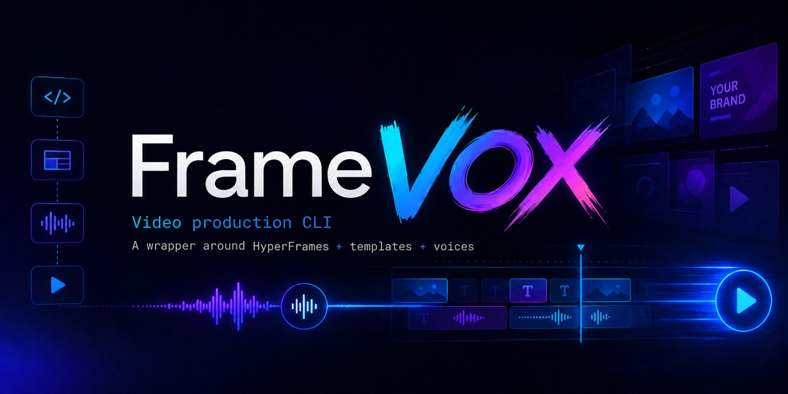

<p align="center">
  <picture>
    <source srcset="public/banner.webp" type="image/webp">
    
  </picture>
</p>

# FrameVOX

Video production CLI — a thin wrapper around **HyperFrames** (HTML → MP4) plus **TTS** (Gemini, Piper, ElevenLabs).

Framevox does not replace HyperFrames. It bundles the pieces agents and humans trip over: scaffold from templates, voice generation with MD5 sanity checks, lint-before-render, API key storage, and production docs.

## Without framevox vs with FrameVOX

**Manual (HyperFrames + curl + ffmpeg):**

```bash
# scaffold — copy files by hand or hyperframes init, then wire assets yourself
mkdir my-promo && cd my-promo
# …create index.html, voice.json, logos, timing…

# voice — curl Gemini, decode base64 PCM, ffmpeg to MP3, hope the API didn't fail silently
GEMINI_API_KEY=… curl -s -X POST "https://generativelanguage.googleapis.com/…" -d '…' -o /tmp/res.json
jq -r '…' /tmp/res.json | base64 -d > /tmp/voice.pcm
ffmpeg -y -f s16le -ar 24000 -ac 1 -i /tmp/voice.pcm -codec:a libmp3lame voice.mp3

# render — separate lint step, ensure hyperframes is installed
npx hyperframes lint
npx hyperframes render --output output.mp4
```

**With FrameVOX:**

```bash
npx framevox init my-promo --template minimal-mobile
npx framevox add-key gemini YOUR_GEMINI_KEY
npx framevox voice
npx framevox render
```

Same output class — one project folder, one `voice.mp3`, one MP4. Framevox collapses ~10 manual steps (and several failure modes) into four commands. HyperFrames is installed automatically as a dependency.

## CLI vs skill (two layers)

| Layer     | What it is                      | Framevox                             | HyperFrames                                   |
| --------- | ------------------------------- | ------------------------------------ | --------------------------------------------- |
| **CLI**   | npm executable (`npx …`)        | `init`, `voice`, `render`, templates | `lint`, `inspect`, `render`, `preview`        |
| **Skill** | Agent instructions (`SKILL.md`) | workflow, templates, TTS keys        | HTML composition rules, GSAP, `data-*` timing |

Framevox is **skill + CLI**. It bundles the HyperFrames **CLI** as a dependency. It does **not** replace the HyperFrames **skill** — agents still need that to edit `index.html` correctly.

After installing FrameVOX, run once:

```bash
npx framevox setup
```

Framevox **detects which agent apps you have** (Claude Code, Cursor, Codex, Antigravity, OpenCode) and installs skills only there — no APX required. Skills land in each app's global skills dir (e.g. `~/.cursor/skills/framevox`).

`npm install -g framevox` prints a first-run hint. After upgrades, `framevox update` reinstalls from npm **and syncs the framevox skill** to detected apps. Check state anytime:

```bash
framevox status
framevox update --check
```

## Quick start

```bash
npx framevox init my-promo --template minimal-mobile
npx framevox add-key gemini YOUR_GEMINI_KEY
npx framevox voice
npx framevox render
```

## Templates

Template layers: **project** `.framevox/templates/` → **user** `~/.framevox/templates/` → **builtin**.

Builtin templates are grouped by **family** — each family shares one `style.css` and ships mobile + desktop variants:

```
templates/promo/
├── style.css          ← shared by mobile + desktop
├── family.json
├── mobile/            ← init as promo-mobile
└── desktop/           ← init as promo-desktop
```

```bash
framevox templates                    # list (project > user > builtin)
framevox templates --json             # for agents
framevox templates add promo          # copy entire family into .framevox/templates/
framevox templates install promo      # install family globally
framevox init my-reel --template promo-mobile
```

Each builtin variant includes `preview.mp4` — show users before choosing.

| Family      | Variants                   | Duration | Scenes | Demo language  | CTA style · Example                       |
| ----------- | -------------------------- | -------- | ------ | -------------- | ----------------------------------------- |
| `minimal`   | `minimal-mobile/desktop`   | 17s      | 3      | Español (AR)   | **Free forever** · Ledgerly (invoicing)   |
| `promo`     | `promo-mobile/desktop`     | 18s      | 5      | English        | **Product launch** · Crewdesk (scheduling)|
| `studio`    | `studio-mobile/desktop`    | 18s      | 5      | Español (AR)   | **Breaking news** · Bitpulse (crypto)     |
| `immersive` | `immersive-mobile/desktop` | 18s    | 5      | Français       | Atelier (creative studio) · hero photo bg |

Brand-specific layouts (e.g. Appsi) belong in the project's `.framevox/templates/` — copy a family and customize there.

## TTS Providers

| Command                             | Effect                        |
| ----------------------------------- | ----------------------------- |
| `framevox add-key gemini KEY`       | Gemini 2.5 Flash TTS (remote) |
| `framevox add-key elevenlabs KEY`   | ElevenLabs (remote)           |
| `framevox add-key piper-voice NAME` | Piper (local, offline)        |
| `framevox keys`                     | Show all configured providers |

Keys live in `~/.framevox/.env` (never commit). Set with `framevox add-key gemini YOUR_KEY`.
Gemini also falls back to `~/.claude/skills/video-docs-builder/.env`.

## Requirements

- Node.js ≥ 22
- ffmpeg (for PCM→MP3 conversion)
- Chrome/Chromium (HyperFrames uses headless Chrome for rendering)
- piper binary (only if using Piper provider)

## Project structure after init

```
my-promo/
├── index.html        ← composition (edit BRAND/COPY comments)
├── voice.json        ← voice script (prompt + text or scenes)
├── DESIGN.md         ← fill brand colors + product info first
├── assets/           ← logo.png, images
├── voice.mp3         ← generated by framevox voice
├── output.mp4        ← generated by framevox render
├── RECIPE.md         ← generated by framevox recipe
└── .framevox/
    └── config.json   ← provider, format, last render metadata
```

## All commands

```bash
framevox init [name] [--template T]          # scaffold project
framevox voice [--provider P] [--voice V] [--scene id]  # --scene = regen one multi-scene segment
framevox render [--out file] [--quality Q] [--no-lint]  # lint + render (HyperFrames bundled)
framevox lint                                # lint only
framevox preview                             # open studio in browser
framevox recipe [title]                      # generate RECIPE.md
framevox add-key <name> <value>              # store API key
framevox keys                                # list key status
framevox templates                           # list templates
framevox templates add <name>                # copy to .framevox/templates/
framevox templates install <name>            # install to ~/.framevox/templates/
framevox status                              # install state + detected agents
framevox setup                               # first-time setup (detected agent apps)
framevox setup --skip-hf-skills              # sync framevox skill only
framevox update                              # npm update + skill sync
framevox update --check                      # check for newer npm version
```

## Voice script format (`voice.json`)

One file for accent, tone, and spoken copy:

```json
{
  "prompt": "Leé en español rioplatense, tono cálido y conversacional:",
  "text": "Bueno che, mirá esto... [eloquent]¡Es una locura![/eloquent] ... [sad]Y después todo cambió.[/sad]"
}
```

**`prompt`** — style guide only (accent, locale, pace). Framevox merges built-in **delivery rules** for Gemini automatically.

**`text`** — single audio (promos ≤ ~20s). **`scenes`** — multi-scene array when copy is longer or you need `framevox voice --scene N`.

```json
{
  "prompt": "Leé en español rioplatense, tono ágil:",
  "gap": 0.3,
  "scenes": [
    { "id": "hook", "text": "Primera línea..." },
    { "id": "cta", "text": "Cierre. miapp punto com." }
  ]
}
```

> **Gemini TTS:** do not set `seed` or `temperature: 0` — they can yield `finishReason: OTHER` with no audio. Prefer **single `text`** + `...` pauses for promos ≤ ~50s (one API call).

Never commit secrets in `voice.json`.

### Emotion tags (Gemini)

Paired open/close tags change delivery inside the span only:

| Tag | Effect |
|-----|--------|
| `[eloquent]...[/eloquent]` | Strong emphasis, theatrical |
| `[sad]...[/sad]` | Subdued, melancholic |
| `[whisper]...[/whisper]` | Quiet, intimate |
| `[excited]...[/excited]` | High energy |

Outside tags → neutral tone. Tag labels are never spoken aloud.

### Ellipsis `...`

Long pause (~1s+) between phrases. Useful for air and scene breathing in a **single** audio file. Framevox can later detect silences to split segments with the same voice.

### Voice production methods

| Method | When | How |
|--------|------|-----|
| **Single audio** | Script ≤ ~20s, fluid narration | `voice.json` with `"text"` → `framevox voice` |
| **Single + tags** | One voice, mood shifts | Tags + `...` in `text` (Gemini) |
| **Multi-scene concat** | Longer copy, per-scene regen | `voice.json` with `"scenes"` + optional `gap` |
| **Multi-scene timed** | Narration must hit visual beats | Explicit `start` per scene in `scenes[]`; overlaps auto-bumped |
| **Regen one scene** | Fix one line without redoing others | `framevox voice --scene 2` or `--scene hook` |
| **ElevenLabs** | English, premium, long form | `--provider elevenlabs` |
| **Piper** | Offline, no API | `--provider piper` |

After `framevox voice`, read `.framevox/voice-timeline.json` — measured times, pauses, collisions.

### Two cut strategies (not opposites)

| | Multi-scene (`voice.json` → `scenes`) | Single audio (`voice.json` → `text` + `...`) |
|---|---|---|
| Cut **when** | Before TTS — you split text | After TTS — silencedetect finds pauses |
| API calls | N | 1 |
| Same voice | ~similar per call | identical |
| Regen part 2 | `--scene 2` | re-run whole script (split: planned) |

Use multi-scene for long copy or per-line fixes. Use single + `...` for fluid promos ≤20s.

Rules source: `src/providers/gemini/rules.js` (auto-merged on every Gemini call).
